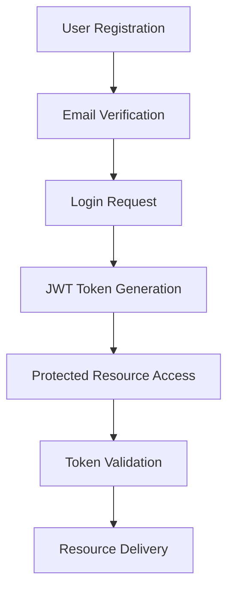

# 💼 Career Guidance Engine - Backend Server

**Repository:** [Mentorship-server](https://github.com/ujjwaljha1/Mentorship-server.git)

A comprehensive Node.js backend server powering an intelligent career guidance and mentorship platform. Built with Express.js, MongoDB, and enhanced with Google's Gemini AI to deliver personalized career recommendations and mentorship experiences.

## 🎯 Overview

The Career Guidance Engine serves as the core backend infrastructure for a modern mentorship platform, enabling students and professionals to discover career paths, connect with industry mentors, and access educational resources through AI-driven recommendations.

## 🚀 Key Features

### 🎯 **Career Exploration**
- AI-powered career recommendations using Google Gemini API
- Comprehensive job market insights and industry trends
- Personalized career path suggestions based on skills and interests

### 🧙‍♂️ **Mentorship Platform**
- Seamless mentor-student matching system
- Appointment booking and scheduling functionality
- Real-time session management and tracking

### 📁 **Resource Management**
- Curated educational content and learning materials
- Workshop and event management system
- Downloadable resources with organized categorization

### 🧑‍💼 **Application Tracking**
- Job application submission and status monitoring
- Unique tracking ID system for application management
- Automated status updates and notifications

### 🎪 **Events & Workshops**
- Comprehensive event management system
- Registration and attendance tracking
- Multi-format support (online/offline events)

### 🧠 **AI-Powered Intelligence**
- Google Gemini API integration for career counseling
- Natural language processing for personalized suggestions
- Intelligent matching algorithms for mentor-student pairing

## 🛠️ Technology Stack

| Category | Technology |
|----------|------------|
| **Runtime** | Node.js |
| **Framework** | Express.js |
| **Database** | MongoDB with Mongoose ODM |
| **Authentication** | JWT (JSON Web Tokens) |
| **AI Integration** | Google Gemini API |
| **Email Service** | Nodemailer |
| **File Handling** | Multer |
| **Security** | bcrypt, CORS, Helmet |

## ⚡ Quick Start

### Prerequisites
- Node.js (v16+ recommended)
- MongoDB (local or Atlas)
- Git

### Installation

```bash
# Clone the repository
git clone https://github.com/ujjwaljha1/Mentorship-server.git
cd Mentorship-server

# Install dependencies
npm install
```

### Environment Configuration

Create a `.env` file in the root directory:

```env
# Server Configuration
PORT=3001
NODE_ENV=production

# Database
MONGODB_URI=mongodb+srv://your-connection-string

# Authentication
JWT_SECRET=your-secure-jwt-secret

# AI Integration
GEMINI_API_KEY=your-gemini-api-key

# Email Configuration
SMTP_HOST=your-smtp-host
SMTP_PORT=587
SMTP_USER=your-email
SMTP_PASS=your-password
```

### Launch Server

```bash
# Development mode
npm run dev

# Production mode
npm start
```

Server will be accessible at `http://localhost:3001`

## 📡 API Architecture

### Core Endpoints

| Endpoint | Description | Authentication |
|----------|-------------|----------------|
| `/api/auth/*` | User authentication and authorization | Public/Protected |
| `/api/careers/*` | Career data and AI recommendations | Protected |
| `/api/mentors/*` | Mentor management and booking | Protected |
| `/api/applications/*` | Job application tracking | Protected |
| `/api/workshops/*` | Event and workshop management | Protected |
| `/api/resources/*` | Educational resource access | Protected |

### Authentication Flow



### Sample API Calls

#### Authentication
```bash
# User Registration
POST /api/auth/signup
Content-Type: application/json

{
  "username": "johndoe",
  "email": "john@example.com",
  "password": "securePassword123",
  "name": "John Doe"
}
```

#### Career Recommendations
```bash
# Get AI-Powered Career Suggestions
POST /api/careers/suggestions
Authorization: Bearer <token>
Content-Type: application/json

{
  "interests": ["technology", "problem-solving"],
  "skills": ["programming", "analysis"],
  "experience": "beginner"
}
```

#### Mentor Booking
```bash
# Book Mentorship Session
POST /api/mentors/book-appointment
Authorization: Bearer <token>
Content-Type: application/json

{
  "mentorId": "mentor_id_here",
  "preferredDate": "2024-01-15",
  "sessionType": "career_guidance"
}
```

## 🔒 Security Implementation

### Multi-Layer Security
- **Password Encryption**: bcrypt hashing algorithm
- **JWT Authentication**: Stateless token-based authentication
- **Role-Based Access Control**: User, Mentor, Admin hierarchies
- **Input Validation**: Comprehensive request sanitization
- **CORS Protection**: Cross-origin request management
- **Rate Limiting**: API endpoint protection against abuse

### Security Best Practices
```javascript
// Password hashing example
const hashedPassword = await bcrypt.hash(password, 12);

// JWT token generation
const token = jwt.sign(
  { userId: user._id, role: user.role },
  process.env.JWT_SECRET,
  { expiresIn: '24h' }
);
```

## 📊 Database Schema

### Core Models

#### User Model
```javascript
{
  username: { type: String, required: true, unique: true },
  name: { type: String, required: true },
  email: { type: String, required: true, unique: true },
  password: { type: String, required: true },
  role: { type: String, enum: ['User', 'Mentor', 'Admin'] },
  profile: {
    jobTitle: String,
    experience: Number,
    skills: [String],
    interests: [String]
  },
  timestamps: true
}
```

#### Career Model
```javascript
{
  jobTitle: { type: String, required: true },
  industry: String,
  averageSalary: String,
  requiredSkills: [String],
  jobOutlook: String,
  description: String,
  companies: [String]
}
```

## 🔧 Development & Deployment

### Development Workflow
```bash
# Run in development mode with auto-reload
npm run dev

# Run tests
npm test

# Code linting
npm run lint

# Production build
npm run build
```

### Docker Deployment
```dockerfile
FROM node:16-alpine
WORKDIR /app
COPY package*.json ./
RUN npm ci --only=production
COPY . .
EXPOSE 3001
CMD ["node", "index.js"]
```

### Cloud Deployment Options
- **Heroku**: Easy deployment with Git integration
- **AWS EC2**: Scalable cloud hosting
- **Digital Ocean**: Cost-effective VPS hosting
- **Railway**: Modern deployment platform

## 📈 Performance & Monitoring

### Performance Optimization
- Database indexing for faster queries
- Response caching for frequently accessed data
- Pagination for large dataset handling
- Connection pooling for database efficiency

### Monitoring Features
- Request/response logging
- Error tracking and reporting
- Performance metrics collection
- API usage analytics

## 🤝 Integration Partners

### Connected Applications
- **Frontend Application**: [MentorShip-FrontEnd](https://github.com/ujjwaljha1/MentorShip-FrontEnd)
- **Live Platform**: [mentorshipsih.netlify.app](https://mentorshipsih.netlify.app/)

### Third-Party Integrations
- **Google Gemini AI**: Career recommendation engine
- **Email Services**: Automated notifications
- **Cloud Storage**: Resource and file management
- **Analytics**: User behavior tracking

## 🧪 Testing & Quality Assurance

### Testing Strategy
```bash
# Unit tests
npm run test:unit

# Integration tests
npm run test:integration

# API endpoint testing
npm run test:api

# Load testing
npm run test:load
```

### Code Quality Tools
- ESLint for code standardization
- Prettier for code formatting
- Husky for pre-commit hooks
- Jest for comprehensive testing

## 📚 Documentation & Support

### API Documentation
- Comprehensive endpoint documentation
- Request/response examples
- Error handling guidelines
- Authentication flow diagrams

### Support Resources
- Detailed setup instructions
- Troubleshooting guides
- FAQ section
- Community forums

## 🚀 Future Roadmap

### Planned Features
- **Advanced AI Integration**: Enhanced career prediction models
- **Real-time Communication**: WebSocket integration for live mentoring
- **Mobile API**: Dedicated mobile application endpoints
- **Analytics Dashboard**: Comprehensive platform insights
- **Multi-language Support**: International platform expansion

### Performance Enhancements
- Redis caching implementation
- GraphQL API development
- Microservices architecture migration
- Enhanced security protocols

## 🤝 Contributing

We welcome contributions from the developer community!

### How to Contribute
1. **Fork** the repository
2. **Create** a feature branch (`git checkout -b feature/amazing-feature`)
3. **Commit** your changes (`git commit -m 'Add amazing feature'`)
4. **Push** to the branch (`git push origin feature/amazing-feature`)
5. **Open** a Pull Request

### Development Guidelines
- Follow established coding standards
- Write comprehensive tests for new features
- Update documentation for API changes
- Ensure backward compatibility

## 📄 License

This project is licensed under the MIT License - see the [LICENSE](LICENSE) file for details.

## 📞 Contact & Support

### Development Team
- **Primary Developer**: [Ujjwal Jha](https://github.com/ujjwaljha1)
- **Project Repository**: [Mentorship-server](https://github.com/ujjwaljha1/Mentorship-server)

### Support Channels
- **Issues**: GitHub Issues for bug reports
- **Discussions**: GitHub Discussions for community support
- **Email**: Technical support via repository contacts

---

**🌟 Star this repository if you find it helpful!**

**Version**: 1.0.0 | **Last Updated**: January 2024 | **Node.js**: v16+ | **MongoDB**: v4.4+# Server
